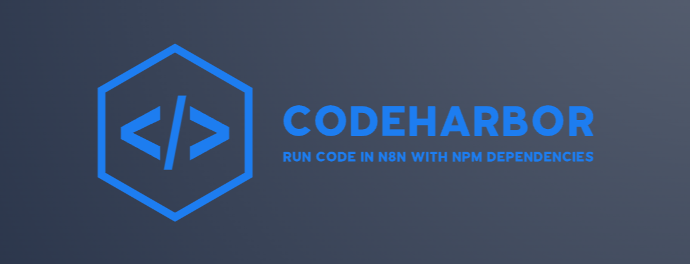

<div align="center">
  
</div>

# n8n-nodes-codeharbor

[](https://www.npmjs.com/package/n8n-nodes-codeharbor)
[](LICENSE.md)

This community node allows you to execute JavaScript code with external NPM dependencies in a secure Docker container environment using the CodeHarbor execution service.

## Features

- Execute JavaScript code with full NPM package support
- Run code once for all items or once per item
- Automatically detect and install dependencies
- Cache dependencies for improved performance
- Debug mode with detailed execution information
- Capture console logs in the execution output
- Secure isolated execution environment

## Requirements

- n8n version 1.0.0 or later
- A running [CodeHarbor-Executor](https://github.com/BrOrlandi/CodeHarbor-Executor) service or access to a hosted instance

## Installation

### In an existing n8n installation

```bash
npm install n8n-nodes-codeharbor
```

### For development

1. Clone this repository
```bash
git clone https://github.com/BrOrlandi/n8n-nodes-codeharbor.git
cd n8n-nodes-codeharbor
```

2. Install dependencies
```bash
npm install
```

3. Build the code
```bash
npm run build
```

4. Link to your n8n installation
```bash
npm link
cd ~/.n8n
npm link n8n-nodes-codeharbor
```

5. Start n8n in development mode
```bash
npm run dev
```

This will start n8n with hot reloading enabled for this node. Any changes you make to the node code will trigger a rebuild, and n8n will automatically use the updated code.

## Credentials

To use the CodeHarbor node, you need to add credentials for connecting to a CodeHarbor-Executor server:

1. In your n8n instance, go to **Settings** > **Credentials** > **Add New**
2. Select **CodeHarbor Server API** from the list
3. Enter the following information:
   - **Server URL**: The URL of your CodeHarbor-Executor server (e.g., `https://codeharbor.server.com`)
   - **API Key**: The authentication token set in the `SECRET_KEY` environment variable of your CodeHarbor-Executor server
4. Click **Create** to save the credentials

## Usage

### Basic Configuration

1. Add the CodeHarbor node to your workflow
2. Select the appropriate **Mode**:
   - **Run Once for All Items**: Processes all incoming items in a single execution
   - **Run Once for Each Item**: Executes the code separately for each incoming item
3. Write your JavaScript code in the **Code** editor
4. Connect your CodeHarbor Server API credentials

### JavaScript Code Examples

#### For "Run Once for All Items" mode:

```javascript
// This function runs once and receives all items as an array
// You can use external npm packages by requiring them

module.exports = function(items) {
  console.log('Processing batch of', items.length, 'items');
  
  // Example: using lodash
  const _ = require('lodash');
  
  // Process all items in a single execution
  const results = _.map(items, item => {
    // Process each item
    console.log('Processing:', item);
    
    // Return a new object with processed data
    return {
      ...item,
      processed: true,
      timestamp: new Date().toISOString()
    };
  });
  
  return results;
};
```

#### For "Run Once for Each Item" mode:

```javascript
// This function runs once for each item
// You can use external npm packages by requiring them

module.exports = function(item) {
  console.log('Processing item:', item);
  
  // Example: using axios for API calls
  const axios = require('axios');
  
  // Process the single item
  const result = {
    ...item,
    processed: true,
    timestamp: new Date().toISOString()
  };
  
  return result;
};
```

### Advanced Options

- **Input Items**: Specify the data to pass to the JavaScript function (for "Run Once for Each Item" mode)
- **Cache Key**: Unique identifier for dependency caching (defaults to workflow ID)
- **Timeout**: Maximum execution time in milliseconds
- **Force Update Dependencies**: Force fresh installation of dependencies
- **Debug Mode**: Return detailed debug information about the execution
- **Capture Console Logs**: Include console logs in the output data

## How It Works

1. Your code and input data are sent to the CodeHarbor-Executor service
2. The service analyzes your code and automatically detects required NPM dependencies
3. Dependencies are installed (or loaded from cache) in an isolated environment
4. Your code is executed with the provided input data
5. The execution results are returned to n8n
6. Console logs and debug information (if enabled) are included in the output

## Security Considerations

- All code is executed in an isolated environment within the CodeHarbor-Executor service
- Execution timeouts prevent infinite loops and long-running processes
- API key authentication protects your CodeHarbor-Executor service from unauthorized access

## Development

For development, you can use the following commands:

- `npm run build`: Build the project
- `npm run dev`: Start n8n with the node in development mode
- `npm run lint`: Check for code issues
- `npm run lintfix`: Fix code issues automatically
- `npm run format`: Format code using Prettier

## License

[MIT](LICENSE.md)
